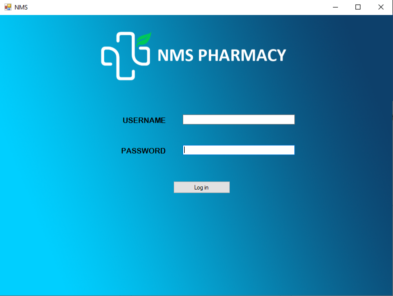
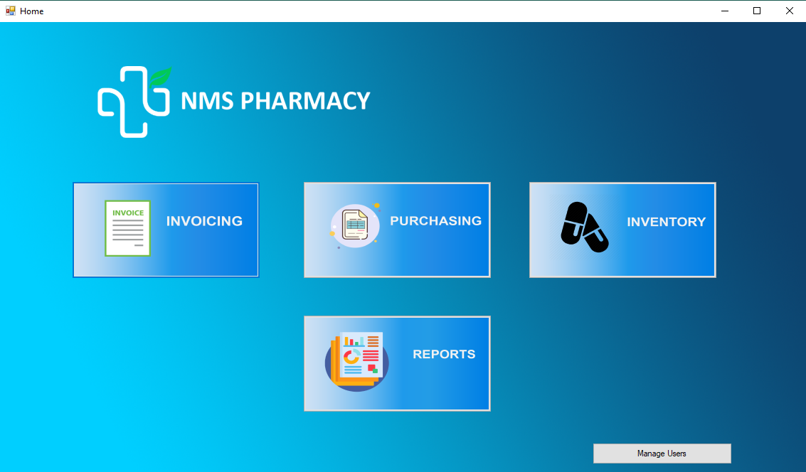
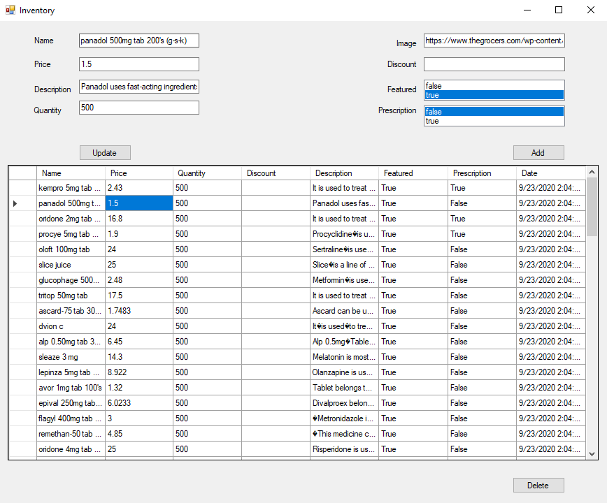
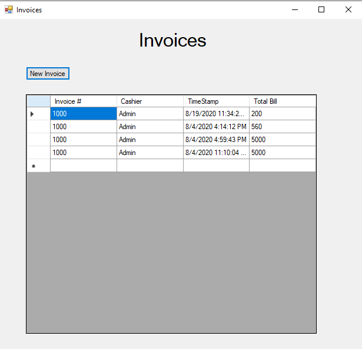
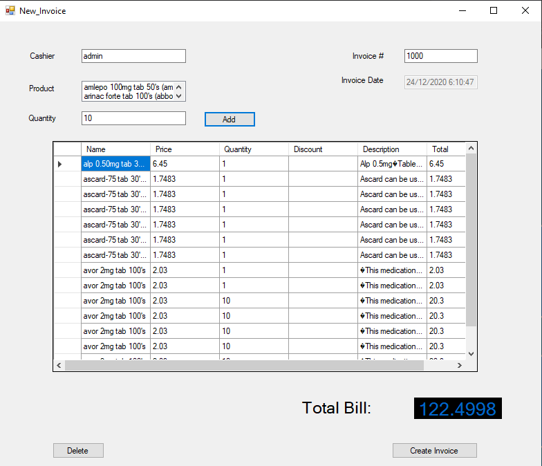
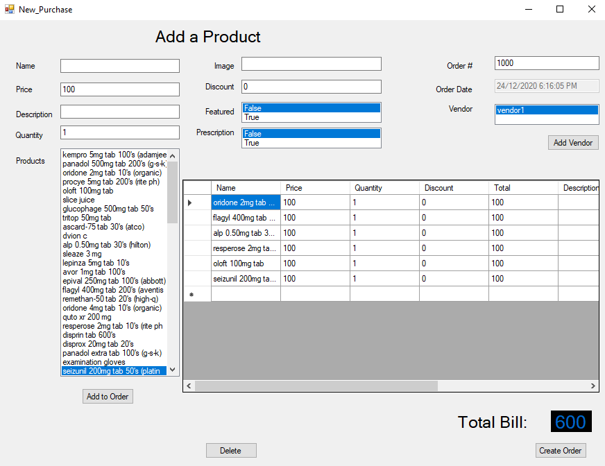
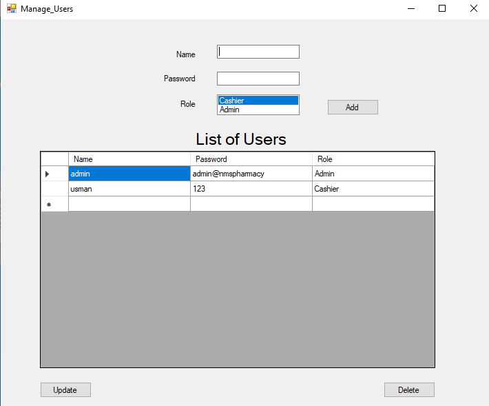
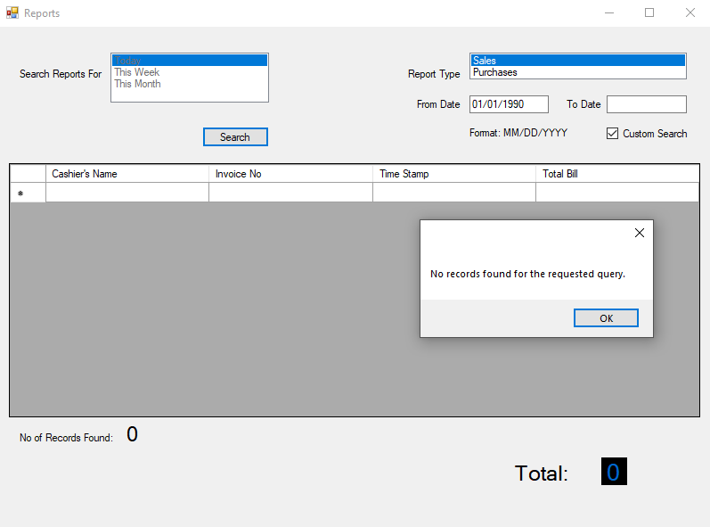

#Point of Sale for NMS Pharmacy

Also check: nmspharmacy.com

This is a standalone Electronic Point of Sale created by me. It uses WPF as its framework and Firebase Realtime Database as its backend. 

Note that all connections are through Firebase and no SQL database has been setup locally.

Any suggestion and feedback is highly appreciated.

#Login Screen:

#Home Screen:

#Inventory:

#Invoices:

#New Invoice:

#Purchasing:

#Manage Users of POS:

#Reporting:

